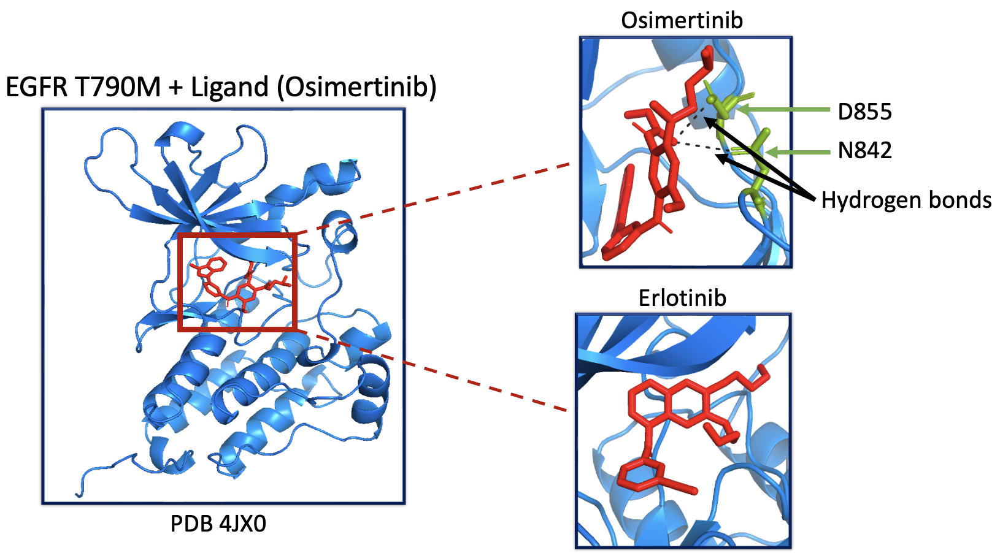
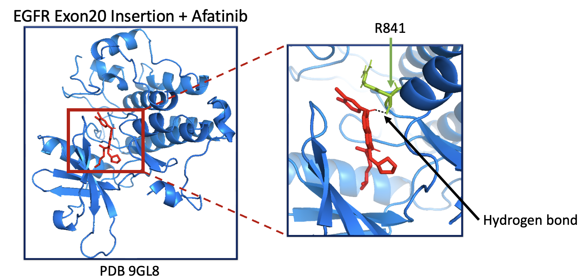

# EGFR TKI Docking Analysis

This repository presents a computational assessment of EGFR wildtype and clinically relevant **resistance mutations** (**L858R, T790M, Exon20 insertions**) against representative tyrosine kinase inhibitors (TKIs) and control ligands (aspirin, caffeine, ibuprofen). Predicted binding affinities were generated using AutoDock Vina, with supporting structural visualisations and interpretive notes.

The aim is to explore how common resistance mutations may affect inhibitor binding and to highlight the strengths and limitations of docking as a predictive tool.

---

## Background

Mutations in the Epidermal Growth Factor Receptor (EGFR) drive oncogenesis in many cancers, particularly non-small cell lung cancer. Targeted TKIs have improved patient outcomes, but the emergence of **resistance mutations** (**L858R, T790M, Exon20 insertions**) reduces their effectiveness.

This project evaluates how representative TKIs interact with wildtype and mutant EGFR at the structural level. Control ligands (aspirin, caffeine, ibuprofen) are included to benchmark nonspecific binding and provide context for predicted affinities.

---

## Workflow & Notes

- Detailed steps for ligand/receptor preparation and docking are provided in [Methods](notes/methods.md)
- Discussion of limitations and interpretation is in [Discussion](notes/discussion.md)
- **Python environments:**
    - General analysis: [`requirements.txt`](env/requirements.txt)
    - Ligand preparation (RDKit & Meeko): [`ligprep_env.yml`](env/ligaprep_env.yml)

All results presented here were generated from the provided `.log` files; running the analysis code with the same inputs reproduces these outputs.

---

## Results

### Binding Affinity Table
Mean ± SD affinities (kcal/mol):

| EGFR receptor | Afatinib | Aspirin (control) | Caffeine (control) | Erlotinib | Gefitinib | Ibuprofen (control) | Mobocertinib | Osimertinib |
|---------------|----------|--------------------|--------------------|-----------|-----------|----------------------|--------------|-------------|
| Wildtype      | -7.76 ± 0.27 | -5.53 ± 0.12 | -5.18 ± 0.04 | -7.20 ± 0.53 | -7.85 ± 0.40 | -6.28 ± 0.10 | -7.93 ± 0.73 | -7.62 ± 0.37 |
| L858R         | -7.58 ± 0.37 | -5.28 ± 0.21 | -5.05 ± 0.12 | -6.53 ± 0.36 | -7.55 ± 0.29 | -6.14 ± 0.26 | -7.79 ± 0.30 | -7.55 ± 0.24 |
| T790M         | -7.73 ± 0.69 | -5.06 ± 0.35 | -5.16 ± 0.15 | -6.56 ± 0.61 | -7.54 ± 0.67 | -5.98 ± 0.24 | -7.68 ± 0.29 | -7.84 ± 0.64 |
| Exon20        | -9.12 ± 0.33 | -5.93 ± 0.61 | -5.75 ± 0.18 | -7.91 ± 0.42 | -8.93 ± 0.33 | -6.74 ± 0.44 | -8.40 ± 0.75 | -8.69 ± 0.63 |

High SD in some mutation classes (e.g., Exon20) indicates variability between PDB structures.

---

### Heatmap

  

Most effective ligand per receptor is circled in black. Heatmap highlights trends across mutations and inhibitors.

---

### Structural Highlights (PyMOL)

**L858R mutation**  
Comparison of binding in the same pocket:  
- **Osimertinib**: 2 H-bonds (T854), weaker predicted fit  
- **Mobocertinib**: 4 H-bonds (M793, T790, L718), stronger predicted fit  

---

**T790M mutation**  
Clinical relevance of Osimertinib:  
- **Osimertinib**: 2 H-bonds (D855, N842), strong binding despite resistance mutation 
- **Erlotinib**: no H-bonds, weak fit  

---

**Exon20 insertion**  
- **Afatinib**: very strong docking score (-9.4 kcal/mol) despite only 1 H-bond (R841).   

Structural highlights emphasise the interplay between pocket geometry, ligand size, and predicted binding.

---

## Discussion & Limitations

- **Statistical bias:** Some receptors, like Wildtype, appear to favor particular TKIs due to strong-binding PDBs (e.g., 8F1X).
- **Exon20 pocket:** Larger surrogate ligands may artificially inflate predicted affinities; variability is reflected in SD.
- **Covalent inhibitors:** Afatinib and Osimertinib form covalent bonds in reality, but Vina only models non-covalent interactions.
- **Static docking:** Protein flexibility is not captured; dynamic effects would require molecular dynamics simulations.
- **Interpretation:** Docking provides preliminary guidance, highlighting trends rather than definitive efficacy.

---

## Takeaways

- Mobocertinib predicted strongest for L858R; Osimertinib robust against T790M.
- Exon20 insertions yield variable results due to pocket differences and surrogate ligands.
- Docking remains a preliminary tool; findings suggest hypotheses for further experimental or simulation-based validation.

---

## References

Trott, O. & Olson, A. J. AutoDock Vina: improving the speed and accuracy of docking with a new scoring function. J Comput Chem 2010, 31, 455–461.

RDKit: http://www.rdkit.org

Meeko: https://github.com/forlilab/meeko

PyMOL: https://pymol.org

Protein Data Bank (PDB): https://www.rcsb.org

ChEMBL Database: https://www.ebi.ac.uk/chembl/

---

## Repository Structure

The repository is organised as follows:

- **`data/`** – Contains all input files required before docking.  
  - `docking_input_files/` – Prepared `.pdbqt` files for docking.  
  - `pdb_files/` – Original and cleaned PDB structures.  
    - `no-water/` – PDBs with water, ions, and ligands removed.  
    - `raw/` – Raw PDB files prior to preprocessing.  

- **`env/`** – Environment installation files.  
  - `requirements.txt` – Python packages for general analysis.  
  - `ligprep_env.yml` – Conda environment specifically for ligand preparation.  

- **`notes/`** – Documentation.  
  - `methods.md` – Detailed description of methods used in this workflow.  
  - `discussion.md` – Notes on limitations and interpretation of results.  

- **`results/`** – Docking outputs and visualisations.  
  - `docking_output_files/` – `.log` and `.pdbqt` files generated during docking.  
  - `figures/` – Heatmaps and PyMOL snapshots highlighting key structural observations.  

- **`scripts/`** – Python scripts and notebooks used for data processing, analysis, and visualisation.  

- **`README.md`** – Provides an overview of the project, including objectives, methods, and key results.
